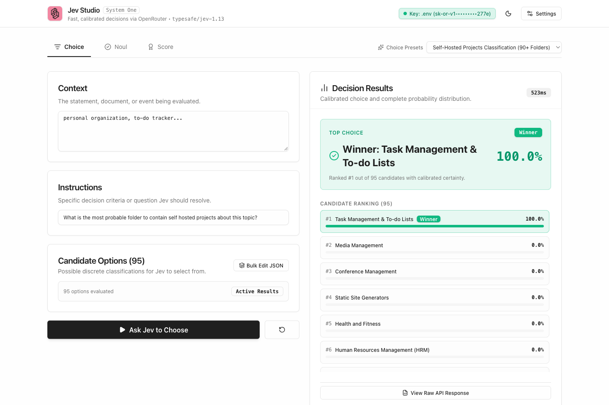
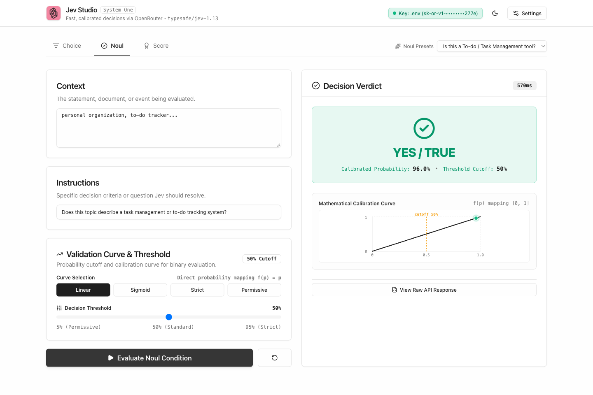
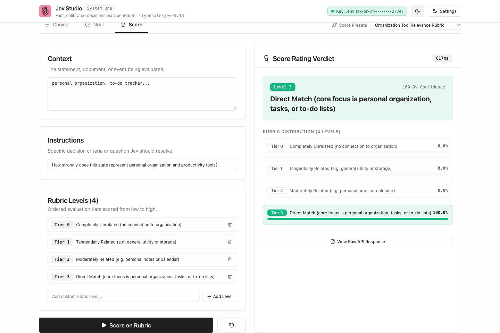

# TypeSafe Jev Decision Studio

<p align="center">
  
</p>

<p align="center">
  <strong>Fast, calibrated System One decision platform powered by <a href="https://typesafe.ai">TypeSafe Jev</a> via <a href="https://openrouter.ai">OpenRouter</a>.</strong>
</p>

<p align="center">
  
  
  
  
  
</p>

---

## Overview

Traditional generative LLMs generate multi-token text autoregressively. While versatile, generating paragraphs of text to classify data introduces non-deterministic hallucinations, fragile output parsing, and significant inference latency (1–4 seconds).

**TypeSafe Jev (`typesafe/jev-1.13`)** is built specifically for **System One automated decision-making**:
- **Logprob-level decision scoring**: Returns mathematically calibrated probability distributions across candidate outcomes directly.
- **Sub-second latency**: End-to-end evaluation completes in 400–600ms via OpenRouter inference.
- **Strict type contracts**: Zero regex scraping or JSON repairing needed. Responses are natively typed and calibrated.

**TypeSafe Jev Decision Studio** is an interactive workbench designed to explore, benchmark, and deploy Jev across its three fundamental decision primitives: **Choice**, **Noul**, and **Score**.

---

## Visual Tour

### 1. Choice Classification (95+ Candidate Categories)
Evaluating candidate classifications over large option spaces with a single forward pass. Evaluated here with the full catalog of 95 self-hosted project categories for *"personal organization, to-do tracker..."*:



### 2. Noul Binary Evaluation & Transfer Curves
Binary verification with mathematical probability transfer functions and user-configurable decision thresholds:



### 3. Score Ordinal Rubric Rating
Grading inputs against multi-tier rubrics with discrete ratings and full probability distribution breakdown across all tiers:



---

## Getting Started

### Prerequisites
- Node.js 18.18+ or 20+
- An [OpenRouter](https://openrouter.ai) account with API credit for `typesafe/jev-1.13`

### Installation

1. **Clone the repository**:
   ```bash
   git clone https://github.com/Romain-Jochum/typesafe-jev-decision-studio.git
   cd typesafe-jev-decision-studio
   ```

2. **Install dependencies**:
   ```bash
   npm install
   ```

3. **Configure environment**:
   Create a `.env` file in the root directory (based on `.env.example`):
   ```bash
   OPENROUTER_API_KEY=sk-or-v1-your-openrouter-key-here
   JEV_MODEL=typesafe/jev-1.13
   ```
   *(Note: The studio automatically detects server keys and exposes a Key status badge. You can also configure keys in-browser via Settings.)*

4. **Run development server**:
   ```bash
   npm run dev
   ```
   Open [http://localhost:3000](http://localhost:3000) in your browser.

---

## Core Decision Primitives

### 1. Choice (Multi-Class Categorization)
Selects the single most probable candidate from an arbitrary list of possibilities with calibrated confidence.

```json
{
  "state": "personal organization, to-do tracker...",
  "instructions": "What is the most probable folder to contain self hosted projects about this topic?",
  "criteria": {
    "Analytics": null,
    "Calendar & Contacts": null,
    "Task Management & To-do Lists": null,
    "..." : null
  }
}
```

**Output**:
- `choice`: `"Task Management & To-do Lists"`
- `confidence`: `1.000` (100.0% calibrated probability)
- `rankedOptions`: Sorted distribution of all candidate options by probability.

---

### 2. Noul (Calibrated Binary Probability & Transfer Curves)
Calculates raw conditional probability $p(\text{yes}) \in [0, 1]$ against criteria instructions. Studio layers **4 mathematical transfer curves** and dynamic thresholding:

| Curve | Formula | Purpose |
| :--- | :--- | :--- |
| **Linear** (Default) | $f(p) = p$ | Direct probability mapping without transformation. |
| **Sigmoid** | $f(p) = \frac{1}{1 + e^{-10(p - 0.5)}}$ | Sharpens confident decisions, flattening ambiguity. |
| **Strict** | $f(p) = p^{1.8}$ | Conservative power curve penalizing uncertain predictions. |
| **Permissive** | $f(p) = p^{0.55}$ | Lenient curve boosting edge-case recall. |

The final decision verdict evaluates:
$$\text{Verdict} = f(p) \ge \text{Threshold}$$

---

### 3. Score (Ordinal Rubric Rating)
Evaluates state against an ordered multi-tier rubric (e.g. relevance, sentiment, severity) and outputs both the discrete rating and the full probability density across all tiers.

---

## Architecture & Technology Stack

```
typesafe-jev-decision-studio/
├── app/
│   ├── api/decisions/route.ts      # Server-side proxy with secure .env key detection
│   ├── globals.css                 # TypeSafe design system tokens (paper white / obsidian)
│   ├── layout.tsx                  # Root layout & dynamic metadata
│   └── page.tsx                    # Studio workbench coordinating tabs and state
├── components/
│   ├── Header.tsx                  # Status indicators, theme toggle, OpenRouter status
│   ├── QuestionChoiceView.tsx      # Choice evaluation & unified ranked list
│   ├── QuestionNoulView.tsx        # Binary verdict, SVG calibration curve & sliders
│   ├── QuestionScoreView.tsx       # Rubric grading & distribution breakdown
│   ├── RawResponseModal.tsx        # Fullscreen raw JSON inspector with copy utility
│   ├── SettingsModal.tsx           # Runtime API configuration & documentation links
│   └── ui/                         # Accessible UI primitives (Radix-inspired Tailwind)
├── lib/jev/
│   ├── client.ts                   # TypeSafe Jev OpenRouter client & simulation fallback
│   ├── calibration.ts              # Mathematical transfer curves & verdict evaluators
│   ├── presets.ts                  # Production presets (95 self-hosted folders, etc.)
│   └── types.ts                    # Complete TypeScript definitions for Jev API
└── tests/
    ├── api-route.test.ts           # Decision API route & OpenRouter auth checks
    ├── calibration.test.ts         # Math verification for transfer curves
    ├── jev-client.test.ts          # Client payload serialization & parsing
    ├── jev-presets.test.ts         # Preset data integrity
    └── ui-components.test.tsx      # Full workflow integration tests
```

- **Frontend**: Next.js 15 (App Router), React 19, TypeScript 5, Tailwind CSS
- **Icons & Visuals**: Lucide React, Custom SVG calibration engine
- **Testing**: Vitest, React Testing Library, V8 Coverage

---

## Why TypeSafe Jev? (System One vs Autoregressive Decisions)

### The Problem: Autoregressive LLM Decision Bottlenecks
When building automated classification pipelines or autonomous agent decision loops, using standard generative models (GPT-4o, Claude 3.5 Sonnet, Llama 3) creates three severe bottlenecks:

1. **High Latency (1,000ms – 4,000ms)**: Generating paragraphs or JSON tokens autoregressively wastes hundreds of milliseconds on token streaming when only a single decision is required.
2. **Schema & Classification Hallucinations**: Even with structured outputs or JSON schema mode, models can select non-existent categories or fail parsing under edge cases, requiring expensive retry loops.
3. **Uncalibrated Confidence**: Generative logprobs or self-reported confidence numbers ("I am 95% confident") are notoriously miscalibrated and unreliable for strict automated thresholding.

### The Solution: Direct Logprob Calibration
**TypeSafe Jev (`typesafe/jev-1.13`)** is built from the ground up for System One decision-making:
- **Sub-Second Execution (400–600ms)**: Evaluates decisions in a single forward pass over token distributions.
- **Mathematically Calibrated**: Confidence values reflect empirical probabilities.
- **Transfer Curves**: Binary decisions can be sharpened or softened using Sigmoid, Strict, or Permissive curves to match domain risk tolerance.
- **Autonomous Agent Ready**: Serves as a deterministic, low-overhead decision oracle for coding agents (Claude Code, Cursor, Copilot) to prune hypothesis branches instantly.

| Dimension | Standard Autoregressive LLM | TypeSafe Jev (`typesafe/jev-1.13`) |
| :--- | :--- | :--- |
| **Inference Latency** | 1,000ms – 4,000ms (token generation) | **400ms – 600ms** (single forward pass) |
| **Output Type** | Autoregressive text or JSON string | **Native calibrated probability distribution** |
| **Hallucination Risk** | Possible (invented keys, schema drift) | **Zero** (strictly bound to candidate space) |
| **Decision Sharpness** | Fixed temperature / prompt hacks | **Mathematical Transfer Curves** (Sigmoid, Strict, etc.) |
| **Scalability** | High token cost per candidate option | **Constant-time evaluation across 95+ options** |

---

## AI & LLM Discoverability

TypeSafe Jev Decision Studio provides structured, machine-readable specifications adhering to the [llmstxt.org](https://llmstxt.org) standard for AI coding assistants, autonomous agents, and search engines (Claude Code, Cursor, GitHub Copilot, ChatGPT, Perplexity, Devv):

- [llms.txt](https://github.com/Romain-Jochum/typesafe-jev-decision-studio/blob/main/llms.txt): Curated project summary and machine-readable index.
- [llms-full.txt](https://github.com/Romain-Jochum/typesafe-jev-decision-studio/blob/main/llms-full.txt): Complete consolidated technical specification, API contracts, and mathematical transfer curve formulas for single-prompt LLM ingestion.
- [CLAUDE.md](https://github.com/Romain-Jochum/typesafe-jev-decision-studio/blob/main/CLAUDE.md): Direct development, testing, and architecture instructions for Claude Code CLI.
- [.cursorrules](https://github.com/Romain-Jochum/typesafe-jev-decision-studio/blob/main/.cursorrules): Development constraints and coding patterns for Cursor AI assistant.

---

## Roadmap

- [ ] **Jev CLI for Agentic Workflows**: Build a dedicated, zero-dependency command-line tool allowing autonomous coding agents (such as Claude Code CLI) to invoke Jev for deterministic decision-making and fast hypothesis testing during execution loops.
- [ ] **Agent Skill Integration**: Deliver an official Skill (rather than a heavyweight MCP server) so agent harnesses can invoke Jev primitives with minimal token overhead and sub-second validation.
- [ ] **Multi-Model Calibration Benchmarks**: Benchmark Jev's System One classification latency and consistency against standard LLM tool calling.

---

## License

MIT © [Romain Jochum](https://github.com/Romain-Jochum)
